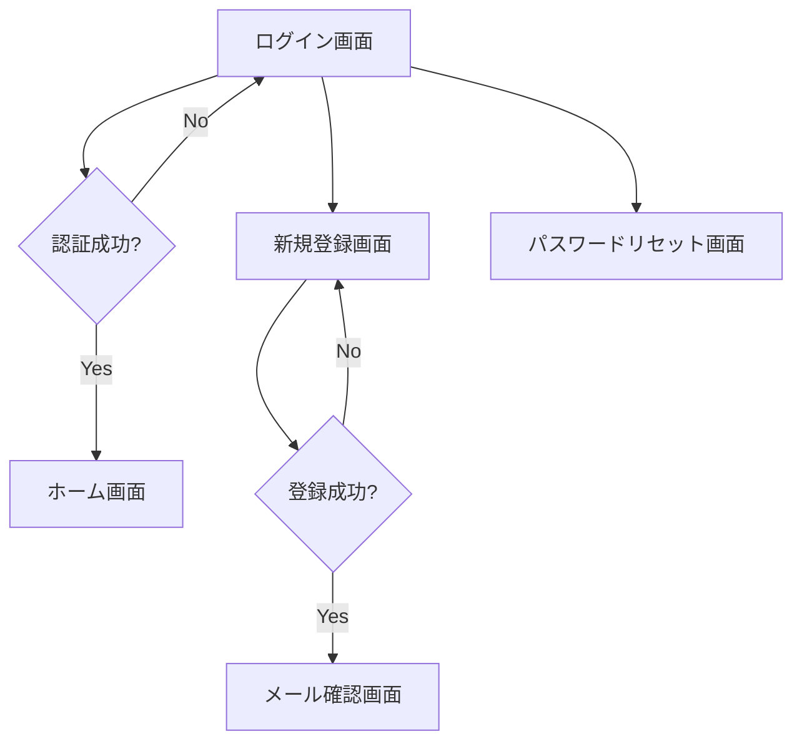
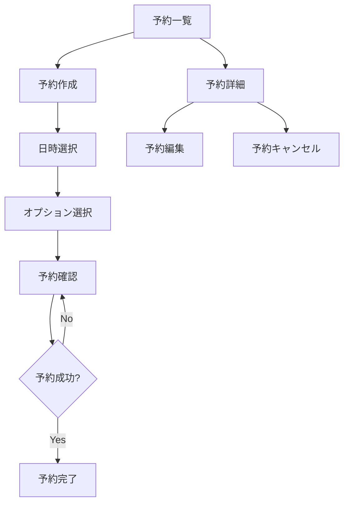
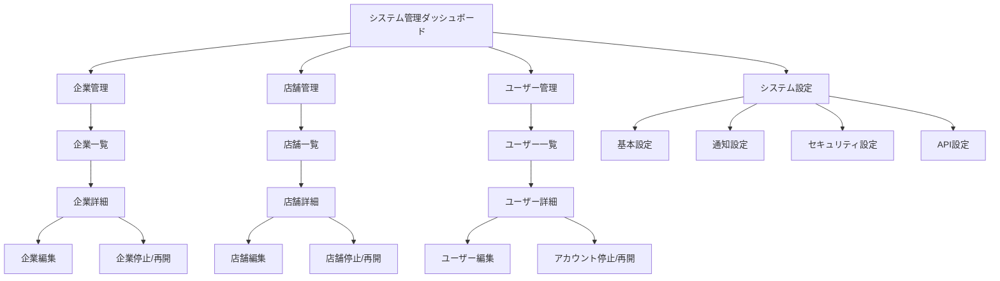
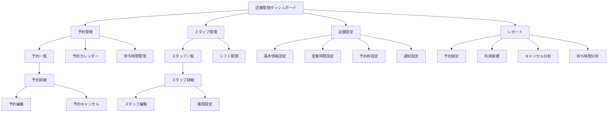

# 画面遷移設計書

## 1. 概要

本システムの画面遷移フローを定義します。ユーザーの操作性と UX を最適化するため、以下の設計方針に基づいて実装を行います。

## 2. 画面一覧

### 2.1 共通コンポーネント

- ヘッダー（`Header.tsx`）
  - ロゴ
  - メインナビゲーション
  - ユーザーメニュー
- フッター（`Footer.tsx`）
  - コピーライト
  - サイトマップ
  - お問い合わせリンク

### 2.2 認証関連画面

- ログイン画面（`/auth/login`）
- 新規登録画面（`/auth/signup`）
- パスワードリセット画面（`/auth/reset-password`）
- メール確認画面（`/auth/verify-email`）

### 2.3 予約関連画面

- 予約一覧画面（`/reservations`）
- 予約詳細画面（`/reservations/:id`）
- 予約作成画面（`/reservations/new`）
- 予約編集画面（`/reservations/:id/edit`）
- 予約確認画面（`/reservations/confirm`）
- 予約完了画面（`/reservations/complete`）

### 2.4 ユーザー関連画面

- プロフィール画面（`/profile`）
- プロフィール編集画面（`/profile/edit`）
- 設定画面（`/settings`）

### 2.5 管理者画面

- ダッシュボード（`/admin`）
- ユーザー管理（`/admin/users`）
- 予約管理（`/admin/reservations`）
- システム設定（`/admin/settings`）

## 3. 画面遷移フロー

### 3.1 認証フロー



### 3.2 予約フロー



### 3.3 システム管理フロー



### 3.4 店舗管理フロー



## 4. 画面レイアウト

### 4.1 共通レイアウト

```tsx
// layouts/MainLayout.tsx
const MainLayout: React.FC = ({ children }) => {
  return (
    <div className="min-h-screen">
      <Header />
      <main className="container mx-auto px-4 py-8">{children}</main>
      <Footer />
    </div>
  );
};
```

### 4.2 認証レイアウト

```tsx
// layouts/AuthLayout.tsx
const AuthLayout: React.FC = ({ children }) => {
  return (
    <div className="min-h-screen bg-gray-50">
      <div className="max-w-md mx-auto p-6">
        <div className="bg-white rounded-lg shadow-lg p-8">{children}</div>
      </div>
    </div>
  );
};
```

## 5. コンポーネント設計

### 5.1 共通コンポーネント

```tsx
// components/Button.tsx
interface ButtonProps {
  variant: "primary" | "secondary" | "danger";
  size: "sm" | "md" | "lg";
  children: React.ReactNode;
  onClick?: () => void;
  disabled?: boolean;
}

const Button: React.FC<ButtonProps> = ({
  variant,
  size,
  children,
  onClick,
  disabled,
}) => {
  // ...
};
```

### 5.2 フォームコンポーネント

```tsx
// components/forms/Input.tsx
interface InputProps {
  type: "text" | "email" | "password" | "number";
  label: string;
  value: string;
  onChange: (value: string) => void;
  error?: string;
  required?: boolean;
}

const Input: React.FC<InputProps> = ({
  type,
  label,
  value,
  onChange,
  error,
  required,
}) => {
  // ...
};
```

## 6. 状態管理

### 6.1 グローバル状態

```tsx
// store/auth.ts
interface AuthState {
  user: User | null;
  isAuthenticated: boolean;
  loading: boolean;
}

const authSlice = createSlice({
  name: "auth",
  initialState,
  reducers: {
    // ...
  },
});
```

### 6.2 ローカル状態

```tsx
// hooks/useReservationForm.ts
const useReservationForm = (initialData?: Reservation) => {
  const [formData, setFormData] = useState({
    date: "",
    time: "",
    // ...
  });

  const validate = () => {
    // ...
  };

  const handleSubmit = async () => {
    // ...
  };

  return {
    formData,
    setFormData,
    validate,
    handleSubmit,
  };
};
```

# 受付表示画面 詳細設計書

## 1. 画面概要

- 目的
- 対象ユーザー
- 表示条件

## 2. 画面レイアウト

- 画面構成図
- コンポーネント配置
- レスポンシブ対応

## 3. 表示項目定義

- 現在番号表示
  - フォントサイズ
  - 表示形式
  - 更新タイミング
- 待ち人数表示
  - 表示形式
  - 更新間隔
- 予想待ち時間
  - 計算ロジック
  - 表示形式

## 4. インタラクション設計

- 画面更新方式
- アニメーション
- エラー表示
- ローディング表示

## 5. 技術仕様

- コンポーネント構成
- データフロー
- API インターフェース
- 状態管理

## 7. 管理画面仕様

### 7.1 システム管理画面

#### ダッシュボード

- システム全体の状態監視
- 重要指標（KPI）の表示
- アラート・通知の表示
- クイックアクション

#### 企業管理

- 企業の登録・編集・停止
- 契約状況の管理
- 利用状況の確認
- 請求情報の管理

#### 店舗管理

- 店舗の登録・編集・停止
- 店舗グループの管理
- 店舗別設定の管理
- 利用状況の監視

#### ユーザー管理

- システム管理者の管理
- 企業管理者の管理
- アクセス権限の設定
- アカウントのロック/解除

#### システム設定

- システム基本設定
- セキュリティ設定
- 通知設定
- API 設定・管理

### 7.2 店舗管理画面

#### ダッシュボード

- 当日の予約状況
- 待ち時間情報
- スタッフ出勤状況
- 重要通知の表示

#### 予約管理

- 予約一覧表示
- カレンダー表示
- 予約詳細確認/編集
- 待ち時間管理

#### スタッフ管理

- スタッフ一覧
- シフト管理
- 権限設定
- 実績管理

#### 店舗設定

- 基本情報設定
- 営業時間設定
- 予約枠設定
- 通知設定

#### レポート

- 予約統計
- 利用実績
- キャンセル分析
- 待ち時間分析
