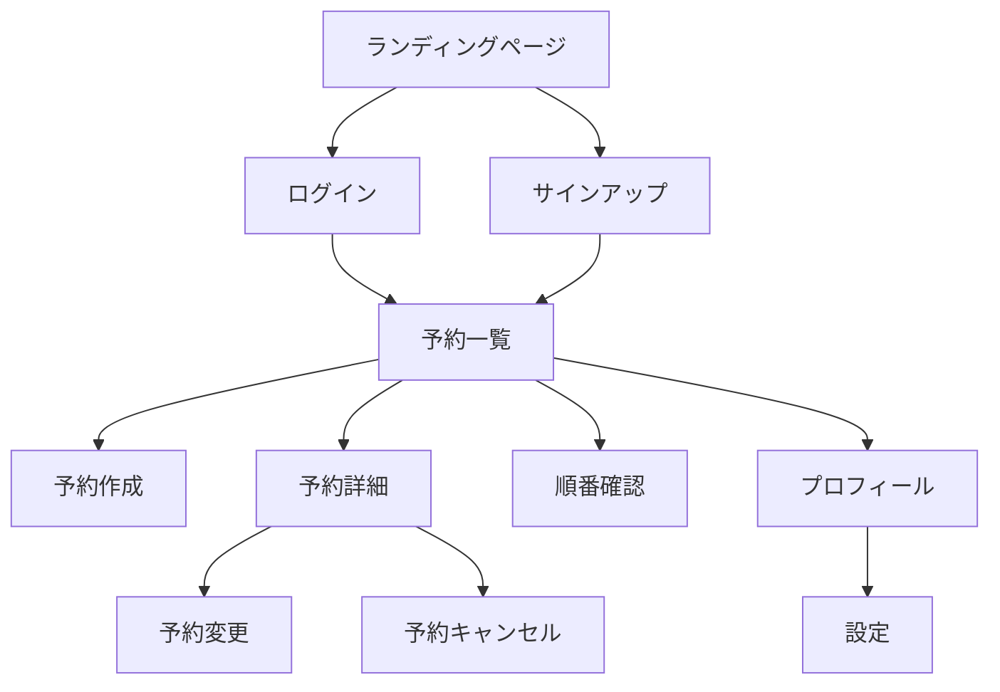

# 画面設計仕様書

## 1. 画面構成概要

### メイン画面グループ

1. **認証系画面**

   - ログイン画面
   - サインアップ画面
   - パスワードリセット画面

2. **予約系画面**

   - 予約一覧画面
   - 予約作成画面
   - 予約詳細画面
   - 順番確認画面

3. **ユーザー系画面**

   - プロフィール画面
   - 設定画面

4. **管理者系画面**
   - 管理ダッシュボード
   - ユーザー管理画面
   - 予約管理画面

## 2. 画面遷移図



## 3. 各画面詳細

### 3.1 認証系画面

#### ログイン画面

```
+------------------------+
| Logo |
| |
| ┌──────────────────┐ |
| | Email            | |
| └──────────────────┘ |
| |
| ┌──────────────────┐ |
| | Password         | |
| └──────────────────┘ |
| |
| [ ログイン ] |
| |
| - パスワードを忘れた方 |
| - 新規登録 |
+------------------------+
```

#### サインアップ画面

```
+------------------------+
| Logo |
| |
| ┌──────────────────┐ |
| | Username         | |
| └──────────────────┘ |
| |
| ┌──────────────────┐ |
| | Email            | |
| └──────────────────┘ |
| |
| ┌──────────────────┐ |
| | Password         | |
| └──────────────────┘ |
| |
| [ 登録する ] |
| |
| - ログインへ戻る |
+------------------------+
```

### 3.2 予約系画面

#### 予約一覧画面

```
+------------------------+
| Header |
|------------------------|
| [新規予約]              |
|                        |
| 予約一覧                |
| ┌──────────────────┐ |
| | 日時: 2024/03/01 | |
| | 時間: 14:00      | |
| | 状態: 確定        | |
| └──────────────────┘ |
| |
| ┌──────────────────┐ |
| | 日時: 2024/03/03 | |
| | 時間: 10:00      | |
| | 状態: 待ち       | |
| └──────────────────┘ |
| |
| [もっと見る] |
+------------------------+

```

#### 予約作成画面

```
+------------------------+
| Header |
|------------------------|
| 新規予約 |
| |
| 日付選択 |
| [カレンダー] |
| |
| 時間選択 |
| [時間枠リスト] |
| |
| ┌──────────────────┐ |
| | 人数 | |
| └──────────────────┘ |
| |
| ┌──────────────────┐ |
| | 備考 | |
| └──────────────────┘ |
| |
| [ 予約する ] |
+------------------------+
```

### 3.3 順番確認画面

```
+------------------------+
| Header |
|------------------------|
| 現在の順番 |
| |
| 現在対応中: 23番 |
| |
| あなたの予約 |
| 予約番号: 25番 |
| 待ち人数: 2人 |
| 予想待ち時間: 15分 |
| |
| 更新日時: 14:30 |
| |
| [更新する] |
+------------------------+
```

## 4. レスポンシブ対応指針

### ブレークポイント

- スマートフォン: 〜767px
- タブレット: 768px〜1023px
- デスクトップ: 1024px〜

### レスポンシブ対応方針

1. **ナビゲーション**

   - モバイル：ハンバーガーメニュー
   - タブレット/PC：水平メニュー

2. **予約一覧表示**

   - モバイル：カード形式
   - タブレット/PC：テーブル形式

3. **フォーム**
   - 入力項目の幅を画面サイズに応じて調整
   - モバイルでは縦長レイアウト優先

## 5. インタラクション設計

### 全体共通

1. **ローディング表示**

   - スケルトン UI
   - プログレスバー

2. **エラー表示**

   - トースト通知
   - インライン表示

3. **確認ダイアログ**
   - 重要な操作時に表示
   - キャンセル可能

### 予約関連

1. **カレンダー選択**

   - スワイプ操作対応
   - 無効な日付は選択不可

2. **時間枠選択**
   - 空き状況をカラーコードで表示
   - タップ/クリックで選択

### 順番確認

1. **自動更新**
   - 1 分ごとに自動更新
   - 手動更新ボタン
   - プッシュ通知対応

## 6. アニメーション設計

### トランジション

1. **画面遷移**

   - スライド効果
   - フェード効果

2. **モーダル表示**
   - フェードイン/アウト
   - スケール効果

### インタラクション

1. **ボタン**

   - ホバーエフェクト
   - クリックエフェクト

2. **リスト項目**
   - スワイプアクション
   - タップエフェクト
